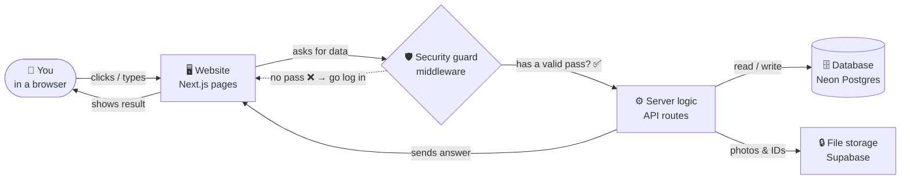
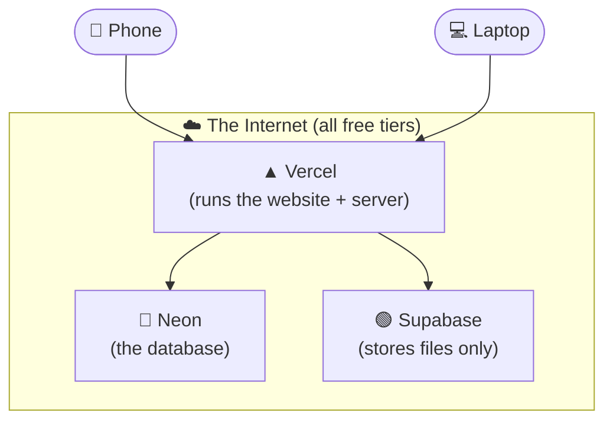
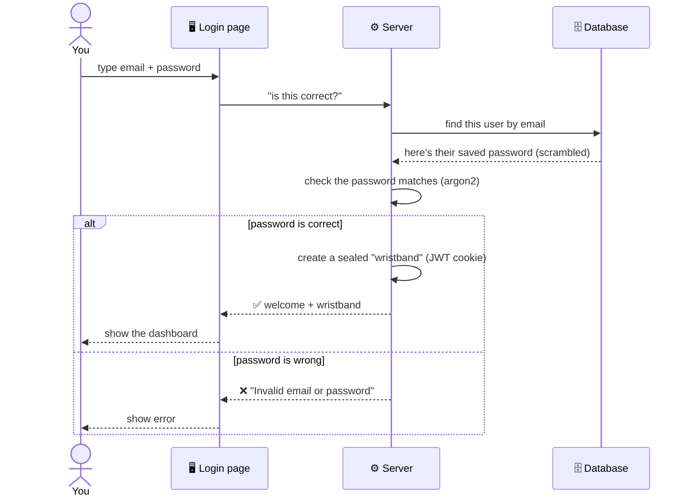
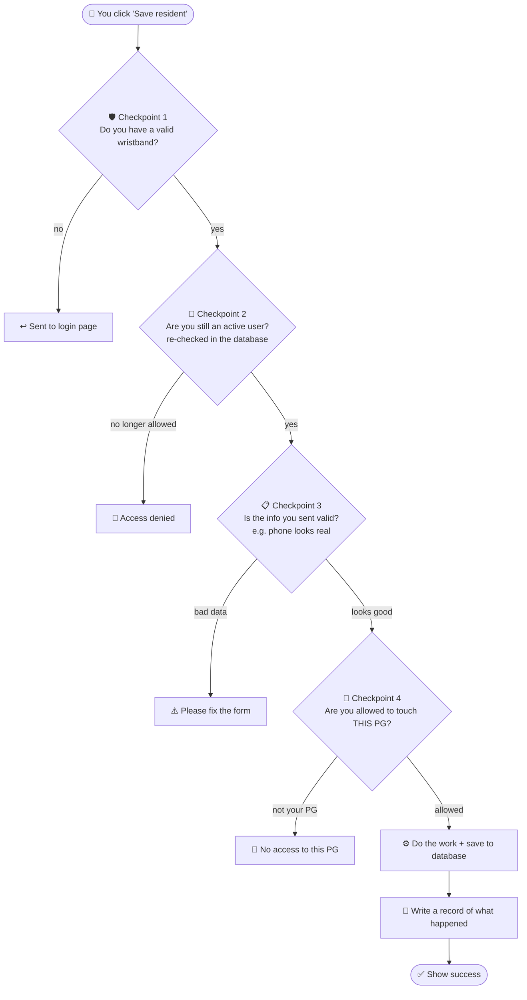
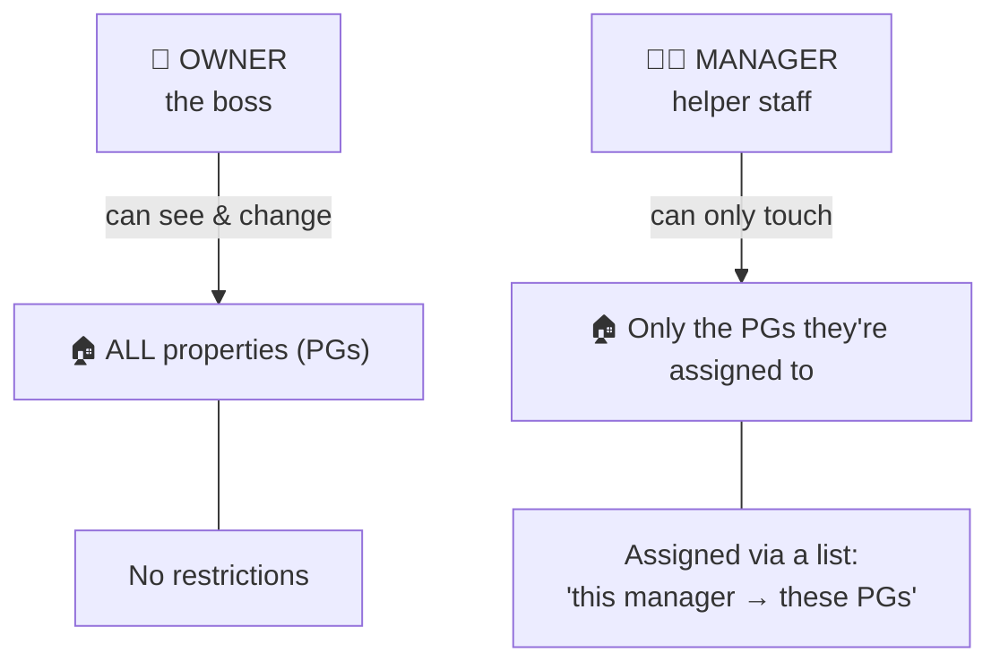
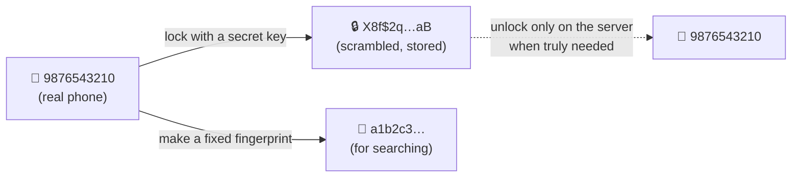
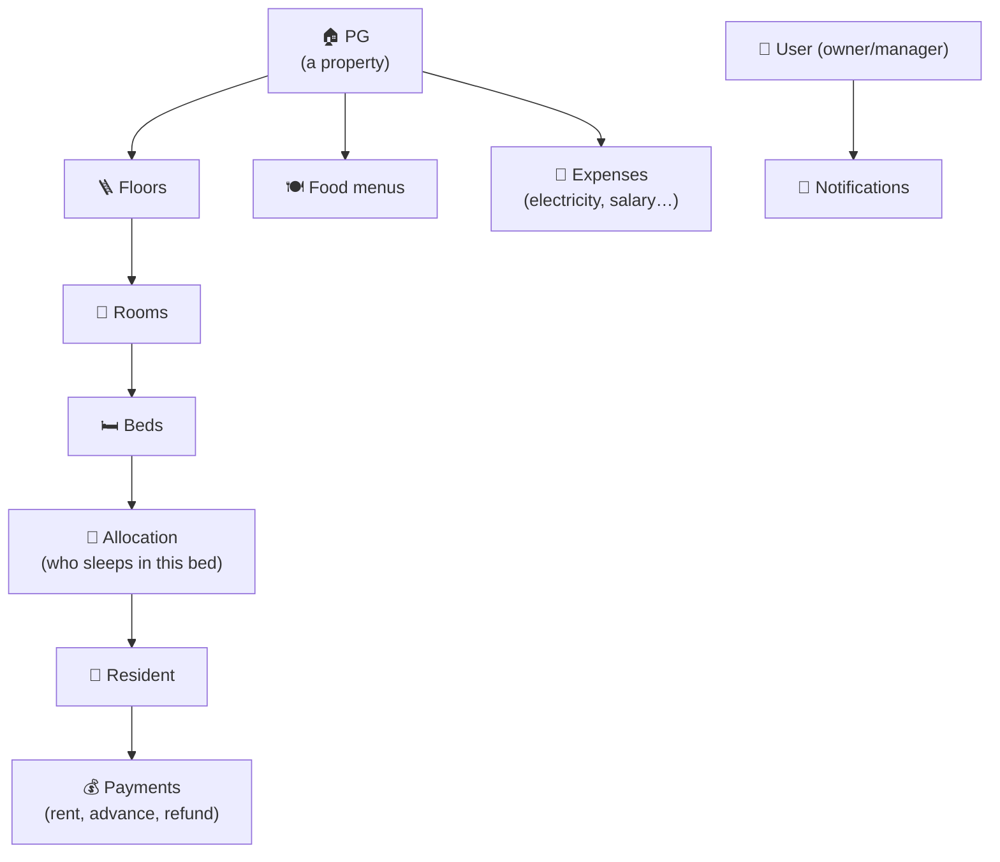
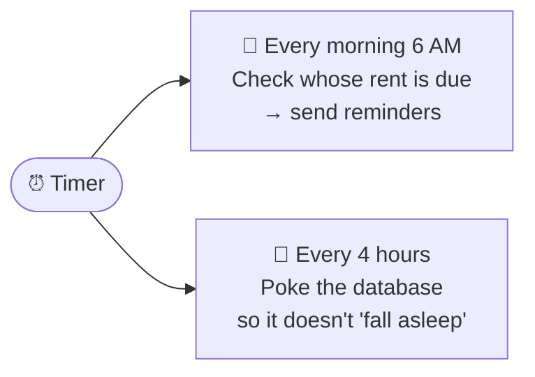
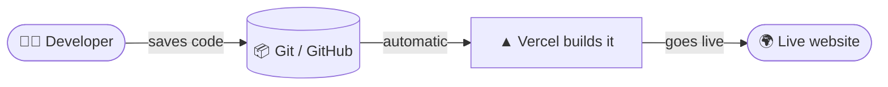
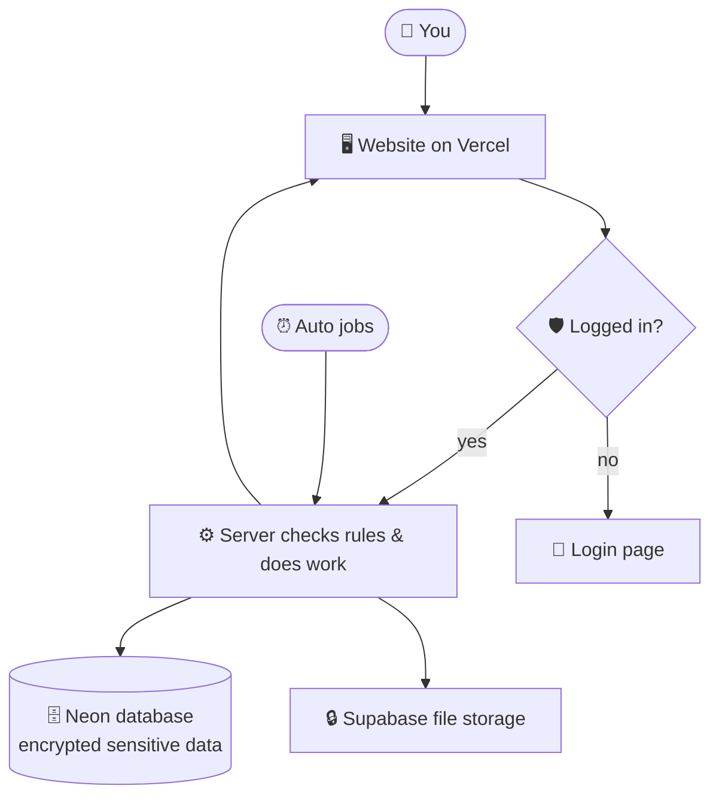

# PG Manager — Visual Architecture Guide

A picture-first explanation of how this app works, written for **someone with no
technical background**. Every diagram below renders automatically on GitHub.

> If you want the precise technical version, read [`ARCHITECTURE.md`](./ARCHITECTURE.md).
> This file is the "explain it like I'm five" version.

---

## 1. The big picture — what are the pieces?

Think of the app like a **shop**:

- The **shopfront** (what you see and click) = the website in your browser.
- The **staff/manager** (does the actual work, checks the rules) = the server.
- The **filing cabinet** (remembers everything) = the database (Neon).
- The **locked store-room** (keeps photos & documents) = file storage (Supabase).
- The **security guard at the door** (checks your pass) = the auth/login system.

**In one sentence:** you click something → a guard checks you're logged in → the
server does the work and looks things up in the database → the answer comes back
to your screen.

---

## 2. Where does everything live?

Nothing runs on a computer in an office. It all lives on the internet, for free:

| Piece     | Plain meaning                                  | Who provides it | Cost |
| --------- | ---------------------------------------------- | --------------- | ---- |
| Vercel    | Hosts the website and runs the server code     | Vercel          | ₹0   |
| Neon      | Remembers all data (residents, rent, rooms…)   | Neon            | ₹0   |
| Supabase  | Holds uploaded photos & ID documents           | Supabase        | ₹0   |

---

## 3. How logging in works (step by step)

Logging in is like getting a **wristband at an event**. You show your ID once;
after that the wristband proves who you are, so you don't show ID again and again.

**Key ideas in plain words:**

- **The password is never stored as-is.** It's scrambled with a one-way method
  called **argon2** — even we can't read it back. At login we scramble what you
  typed the same way and check the two scrambles match.
- **The "wristband" is a cookie** that lives in your browser. It's *sealed* so
  nobody can fake or tamper with it, and it's *invisible to other websites and to
  page scripts* (httpOnly), so it can't be stolen easily.
- **It lasts 7 days.** After that you log in again.
- **There is no public sign-up.** Only the owner account exists, created once by
  an administrator. (Fewer accounts = nothing to hack and ₹0 cost.)

---

## 4. What happens on every click after login?

Every time you do something (open a page, save a resident, record rent), the same
safety checks run. Think of it as **passing through several checkpoints**:

Why so many checkpoints? Because **never trust the browser**. Even if someone
tries to skip the website and talk to the server directly, the server re-checks
everything itself.

---

## 5. Who can do what? (permissions)

There are two kinds of users:

- An **Owner** sees and controls everything.
- A **Manager** is limited to the specific properties they're given. The server
  keeps a simple list ("this manager is allowed these PGs") and checks it on every
  action (Checkpoint 4 above).

---

## 6. How data is kept safe

Sensitive details (phone numbers, ID proofs) are **locked before being stored**,
like putting valuables in a safe instead of leaving them on a desk.

- **Encrypted (locked):** the real phone number is scrambled with a secret key.
  Stored scrambled; only the server can unlock it, and only when needed.
- **Fingerprint (for search):** a separate one-way "fingerprint" lets the app
  find a resident by phone *without* ever unlocking the real number.
- **Audit log:** every change writes a history record — but sensitive fields are
  removed first, and even the visitor's address (IP) is stored as a fingerprint,
  not the real thing.

So if someone ever stole the database file, they'd see scrambled gibberish, not
people's actual phone numbers.

---

## 7. The data — how things relate

This is the "filing cabinet" layout. Read the arrows as **"has many"**:

A **PG** has floors → each floor has rooms → each room has beds → a bed is given
to a **resident** → who makes **payments**. The same PG also tracks **food** and
**expenses**.

> 💡 Money is always stored in **paise** (whole numbers), never rupees with a
> decimal point — this avoids rounding mistakes (₹5,000.00 is stored as `500000`).

---

## 8. Things that happen automatically (no human needed)

A robot assistant runs on a timer (called "cron"):

- **Rent reminder:** each morning it finds residents whose rent is due today or
  tomorrow and notifies the owner/managers. It won't send the same reminder twice.
- **Keep-awake:** the free database "sleeps" when unused; a tiny check every few
  hours keeps it awake so the app stays fast.

---

## 9. How a change reaches the live app

When a developer improves the app:

A simple "save and upload" (`git push`) makes Vercel rebuild and publish the new
version automatically — no manual server work.

---

## 10. One-screen recap

| Question                        | Short answer                                              |
| ------------------------------- | -------------------------------------------------------- |
| Where is the website?           | Vercel (free)                                             |
| Where is the data?              | Neon database (free)                                      |
| Where are photos/IDs?           | Supabase storage (free)                                   |
| How does login work?            | Password check (argon2) → sealed cookie "wristband" (7d)  |
| Is my data safe?                | Sensitive fields are encrypted; every action is logged   |
| Who can do what?                | Owner = everything; Manager = only assigned properties    |
| What costs money?               | Nothing — all on free tiers = ₹0                          |

---

*Want the developer-level detail (exact files, env vars, security controls)?
See [`ARCHITECTURE.md`](./ARCHITECTURE.md) and [`NEON_SETUP.md`](./NEON_SETUP.md).*
